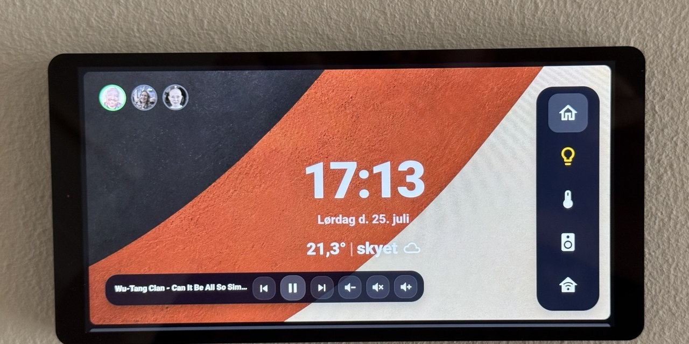
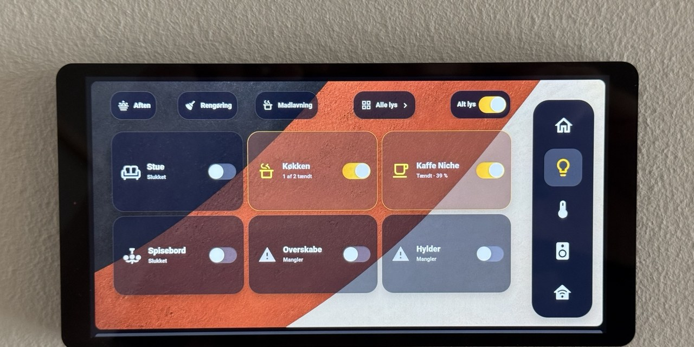
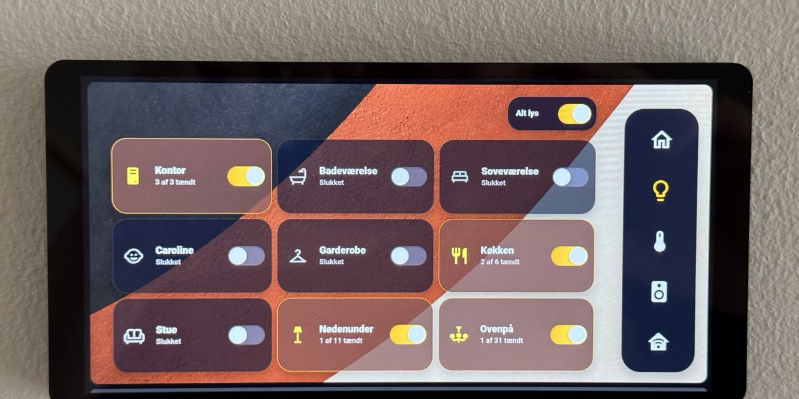
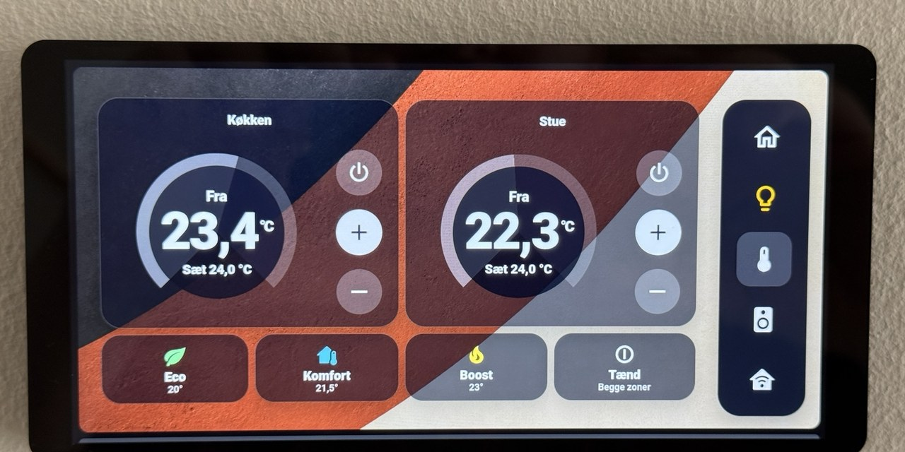
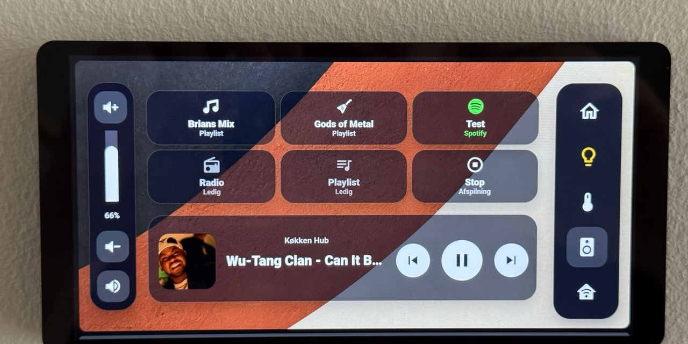
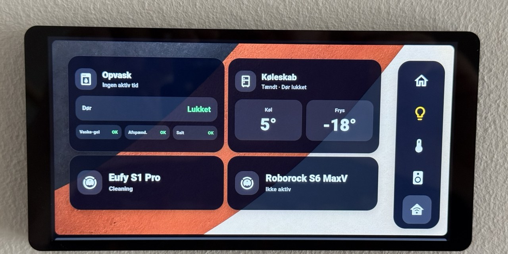

# MiniPanel - Home Assistant Dashboard

A full-screen Home Assistant dashboard designed for the Shelly Wall Display X2i, the older Shelly Wall Display X2, and other wall-mounted panels running in kiosk mode.



## Features

- **Full-screen panel layout** with a custom background image
- **Kiosk mode** that hides the Home Assistant header and sidebar
- **5 main views**: Home, Lys (Lights), Klima (Climate), Musik (Music), and Status
- **Real-time clock and weather** on the Home view
- **Family presence** indicators with avatar photos
- **Dishwasher status** shown only when a program is running
- **Mini music player** with playback controls on the Home view
- **Fixed navigation menu** with active-state highlighting
- **Lights view** with scenes, room controls, and a master switch
- **All Lights drill-down** with controls for every configured light group
- **Climate view** with two heating zones and shared presets
- **Music view** with playlist shortcuts, playback controls, and volume control
- **Status view** for appliances and robot vacuum cleaners
- **Idle return** that automatically navigates back to Home after 60 seconds of inactivity

## Screenshots

### Home

Main overview with clock, weather, family presence, mini media controls, and the fixed navigation menu.

**Dashboard path:** `/dashboard-minipanel/home`


### Lights

Primary lighting view with scenes, room-level controls, an All Lights shortcut, and a master switch.

**Dashboard path:** `/dashboard-minipanel/lys`



#### All Lights

A drill-down page opened from the Lights view. It is not a separate item in the right-side navigation menu.



### Climate

Two climate zones with current and target temperatures, power controls, temperature adjustment, and preset buttons.

**Dashboard path:** `/dashboard-minipanel/klima`



### Music

Playlist shortcuts, source controls, a full media player, and vertical volume control.

**Dashboard path:** `/dashboard-minipanel/musik`



### Status

Status information for the dishwasher, refrigerator/freezer, and robot vacuum cleaners.

**Dashboard path:** `/dashboard-minipanel/status`



## Views

| View | Path | Description |
|------|------|-------------|
| Home | `/dashboard-minipanel/home` | Clock, weather, family presence, mini player, and navigation |
| Lys | `/dashboard-minipanel/lys` | Scenes, room controls, All Lights drill-down, and master switch |
| Klima | `/dashboard-minipanel/klima` | Climate controls and presets |
| Musik | `/dashboard-minipanel/musik` | Playlists, volume, and full music player |
| Status | `/dashboard-minipanel/status` | Appliance and system status |

## Required HACS Custom Cards

- [button-card](https://github.com/custom-cards/button-card): Primary card used throughout the dashboard
- [kiosk-mode](https://github.com/NemesisRE/kiosk-mode): Hides the Home Assistant header and sidebar

## Installation

### 1. Install the required HACS components

Install `button-card` and `kiosk-mode` through HACS.

Restart Home Assistant if required.

### 2. Copy the background image

Copy `minipanelbackground.png` to your Home Assistant `www` folder:

```bash
cp minipanelbackground.png /config/www/
```

The image will then be available in Home Assistant as:

```text
/local/minipanelbackground.png
```

### 3. Create the dashboard

1. Go to **Settings > Dashboards**
2. Click **Add dashboard**
3. Choose **New dashboard from scratch**
4. Enter a title, for example `MiniPanel`
5. Set the URL to exactly:

```text
dashboard-minipanel
```

6. Create the dashboard

The dashboard URL is important because the navigation buttons use fixed paths such as:

```text
/dashboard-minipanel/home
/dashboard-minipanel/lys
/dashboard-minipanel/klima
/dashboard-minipanel/musik
/dashboard-minipanel/status
```

If you use another dashboard URL, you must replace every `/dashboard-minipanel/` reference in `minipanel.json`.

### 4. Import the dashboard configuration

1. Open the new MiniPanel dashboard
2. Select **Edit dashboard**
3. Open the three-dot menu
4. Select **Raw configuration editor**
5. Replace the existing content with the contents of `minipanel.json`
6. Save the dashboard

Do not copy the file directly into `/config/.storage/`. Home Assistant manages that folder internally.

### 5. Configure kiosk mode

The dashboard is configured to hide the interface for the Home Assistant user named `Shelly`.

Edit the `kiosk_mode` section in `minipanel.json` to match the user account used by your wall display.

### 6. Replace the example entities

The dashboard uses entity IDs from my own Home Assistant installation.

Replace them with the corresponding entities from your setup.

## Customization

### Entity IDs

| Dashboard reference | Replace with |
|---------------------|--------------|
| `light.stue_lights` | Living room light group |
| `light.kontor_lights` | Office light group |
| `light.kokken_lights` | Kitchen light group |
| `light.nordtronic_a_s_rotdimz_98424072` | Bathroom light |
| `light.caroline_lights` | Bedroom or family-room light group |
| `light.sovevaerelse` | Main bedroom light |
| `media_player.kokken_hub_2` | Media player |
| `sensor.udendors_temperatur` | Outdoor temperature sensor |
| `weather.forecast_home` | Weather entity |
| `person.*` or `device_tracker.*` | Presence entities |
| `sensor.opvaskemaskine_current_program_remaining_time` | Dishwasher remaining-time sensor |

### Scripts

The music shortcut buttons reference these scripts:

- `script.1783163503917`: Brians Mix
- `script.gods_of_metal`: Gods of Metal
- `script.musik_liked_songs_pa_kokken_hub`: Spotify Liked Songs

Replace them with your own Music Assistant or media-control scripts.

### Background image

Replace `minipanelbackground.png` in `/config/www/` with your own image while keeping the same filename.

You can also change the image path directly in `minipanel.json`.

### Dashboard paths

The right-side navigation menu uses fixed dashboard paths.

Keep the dashboard URL as:

```text
dashboard-minipanel
```

If you change it, update all navigation paths in `minipanel.json`.

## Notes

- The layout is optimized for the Shelly Wall Display X2i in landscape orientation.
- It can also run on the older Shelly Wall Display X2, although spacing and scaling may require adjustment.
- Light commands are executed immediately. Any visible delay normally comes from the dashboard waiting for the updated entity state from Home Assistant.
- The All Lights page belongs to the Lights section and is not a sixth main navigation view.
- The screenshots show my own entities, names, temperatures, and media. Your setup will differ after replacing the example entities.

## Repository structure

```text
MiniPanel/
├── README.md
├── minipanel.json
├── minipanelbackground.png
└── screenshots/
    ├── 01-home.jpg
    ├── 02-lights.jpg
    ├── 03-all-lights.jpg
    ├── 04-climate.jpg
    ├── 05-music.jpg
    └── 06-status.jpg
```

## License

MIT
